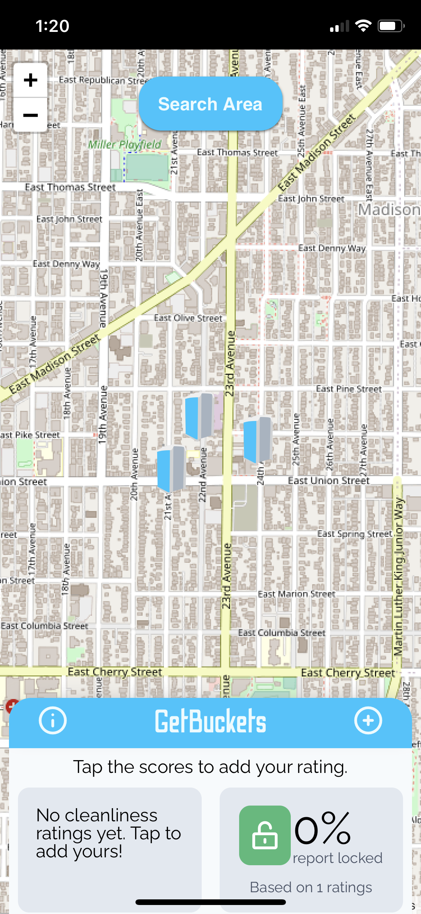

# GetBuckets

This is the frontend for [GetBuckets](https://wegetbuckets.net)—a joke with a friend that probably went too far. He goes on long runs, and it turns out he knows where all of the [Honey Buckets](https://www.honeybucket.com/) are located for miles around. 

The UI is written in React and is meant to be used as a Progressive Web App and installed to the homescreen on a mobile device. It works in conjunction with [getbuckets-be](https://github.com/rtravitz/getbuckets-be). Users can see existing bucket locations, add new buckets, and rate the existing buckets.

## Running
To run the frontend you'll need Node 12+. Go ahead and `npm install` and then `npm start`. You'll also want the backend running, so head on over [to that repo](https://github.com/rtravitz/getbuckets-be).

## Tests
For this silly thing?

## Other comments
Maps are handled by [Leaflet](https://leafletjs.com/) and [OpenStreetMap](https://leafletjs.com/).
